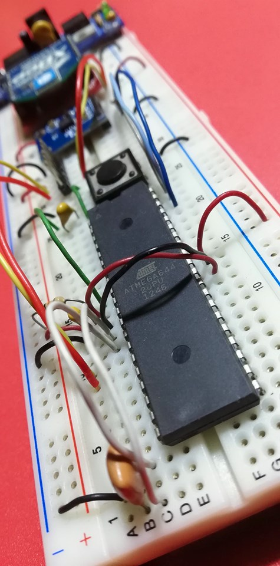

## Neural network con arduino ATmega644  

<a href="http://www.youtube.com/watch?feature=player_embedded&v=-N2bvr8qKh4
" target="_blank"></a>  

### Antecedentes  
En busca de una metodología para la integración de modelos con redes neuronales en micro controladores y especialmente para  desarrollo con la plataforma de *Arduino*, se elaboraron experiencias con el set de datos de *IRIS*, con el objetivo de determinar la precisión y eficiencia en un _Duemilanove_. En una primera experiencia  se realizó el entrenamiento y testeo  en el micro controlador *ATmega328*; pero luego gracias al aporte de *David Castillo Alvarado*, se implementó el entrenamiento con keras y el testero en el micro controlador.  

El proceso se resume en la transferencia de Pesos y Sesgos encontrados durante el entrenamiento en _Keras_  en formato de arreglo,  al mico controlador y la reconstrucción del modelo para realizar la predicción con el  lenguaje de _Arduino_.  

### Desafíos  
El principal limitante para la realización de este proceso se encuentran el evitar el desborde del la memoria dinámica (SRAM) del micro controlador con las operaciones (matrices) que requiere la reconstrucción del modelo de redes neuronales.  

 
### Proceso  
__Definición de modelo:__ determinar el modelo que mejores resultados se obtenga con los datos de test. Ejemplo:   

```python
modelo.add(Dense(16, input_dim=15, activation='relu'))	# CAPA[0]
modelo.add(Dense(16, activation='relu'))    		      # CAPA[1]
modelo.add(Dense(3, activation='sigmoid'))			    # CAPA[2]
```  

__Obtener los pesos y sesgos:__ Luego de realizar el entrenamiento, se pueden obtener los resultados de las constantes (pesos y sesgos) optimizadas con el siguiente código:  

```python
model.layers[CAPA].get_weights()
```   
La denominación _CAPA_, hace referencia a la definición de capa del modelo en el proceso previo. El código devuelve dos conjuntos de datos (arreglos): asignando los __pesos y sesgos__ a los indicies 0(cero) y 1(uno) correspondientes.  

 __Reconstrucción de las constantes en Arduino:__ para la operación de matrices usaremos la librería __“MatrixMath”__. Esto determinará la manera de definir los valores de pesos y sesgos, ejemplo:

```javascript
mtx_type Pesos_Capa[3][5]  = {{ 0,0,0,0,0},
                              { 0,0,0,0,0},
                              { 0,0,0,0,0}};

```  
Reconstrucción del modelo en Arduino: en esta etapa se aplicará una función de activación definida en __Keras__ a la suma pondera en cada capa:

>  y = _f_ (Wx + B)  

Los valores de __x__ representan a la _ENTRADA_ e __y__ los valores de _SALIDA_. __W__ es igual los Pesos y __B__ a los sesgos.Este proceso se los dividiremos en dos partes: la suma ponderada (Wx+B) y la aplicación de la función de activación ( _f_ ). Para la suma ponderada  haremos uso de las funciones  _Matrix.Multiply_ y _Matrix.Add_ de  la biblioteca __MatrixMath__.  Finalmente para aplicar las funciones de activación definiremos algunas funciones.  

```javascript
float sigmoid(float x){
  return 1.0/(exp(-x)+1.0);
}
float relu(float x){
  if( x >= 0){
    return x;
  }else{
    return 0; 
  }
}

```  

Todas estas operaciones serán encadenadas: una detrás de otra.  La primera _ENTRADA_ corresponde a los datos que queremos evaluar (predecir) y será multiplicada a los pesos de la primera capa definida en __keras__,  luego se sumarán a los sesgos correspondientes. Finalmente se aplicará la función de activación para luego pasar a la siguiente capa, que tendrán las mismas operaciones con los valores correspondientes hasta finalizar el proceso.  

  


La _SALIDA_ es el resultado que será un arreglo con tres valores, para este caso. El mayor valor determinará el índice de la categoría activada.En el ejemplo el valor mayor es el correspondiente al índice cero ```[0]```. 

``` python
[0.30	0.01	0.05]
```

### Consideraciones  
- __La cantidad de capas__ del modelo incrementará la cantidad de pesos y sesgos del modelo. Esto aumentará la cantidad de operaciones realizadas en Arduino que podría desbordar la memoria dinámica  (SRAM).
- Las __dimensiones__ de las capas incrementará la cantidad de pesos y sesgos.
- La  cantidad de valores de las __muestras__ incrementan la dimensión de entrada de la primera capa.
- La cantidad total de muestras no incrementa el total de pesos y sesgos.
- Los valores de las muestras deben estar __normalizados__ entre valores cercanos a CERO.


```python

```
